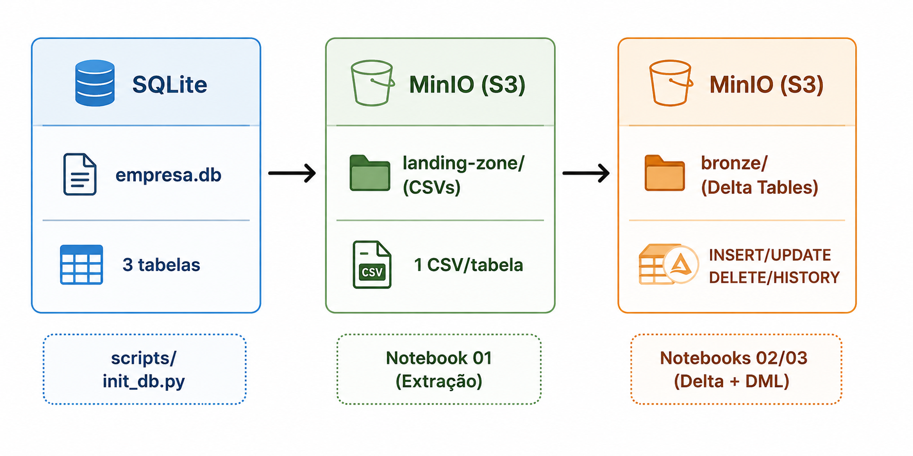
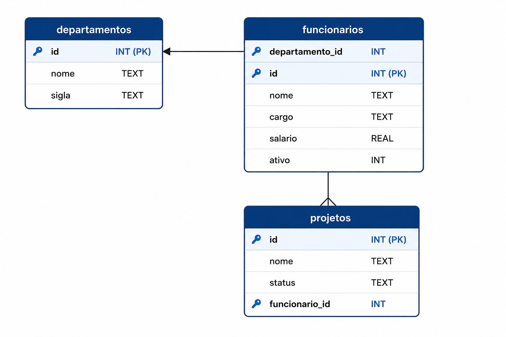

# 🚀 Spark + Delta + MinIO
# Projeto Spark + Delta Lake + MinIO

Projeto de estudo de Data Lakehouse.
> Pipeline de dados com **Apache Spark**, **Delta Lake** e **MinIO** | Arquitetura de Dados | SATC

## 📌 Objetivo
Demonstrar uso de Spark com Delta Lake e MinIO.
---

## 🧱 Arquitetura
- Spark
- Delta Lake
- MinIO
## Sobre o Projeto

Este projeto implementa um pipeline de dados completo seguindo a **Arquitetura Medalhão**, extraindo dados de um banco relacional SQLite, carregando-os em um Object Storage (MinIO) e convertendo-os para o formato **Delta Lake** com suporte a operações transacionais.

O objetivo é demonstrar como construir uma camada de ingestão e armazenamento confiável para um Data Lakehouse, utilizando ferramentas open-source amplamente adotadas no mercado.

---

## Arquitetura do Pipeline

---

## Cenário dos Dados

O banco de dados simula o domínio de **recursos humanos de uma empresa**, com 3 tabelas relacionadas:

### Tabela: `departamentos`

| Coluna | Tipo | Descrição |
|---|---|---|
| `id` | INTEGER | Identificador único |
| `nome` | TEXT | Nome do departamento |
| `sigla` | TEXT | Sigla do departamento |

### Tabela: `funcionarios`

| Coluna | Tipo | Descrição |
|---|---|---|
| `id` | INTEGER | Identificador único |
| `nome` | TEXT | Nome do funcionário |
| `cargo` | TEXT | Cargo atual |
| `salario` | REAL | Salário em R$ |
| `departamento_id` | INTEGER | Chave estrangeira para departamentos |
| `ativo` | INTEGER | Status (1 = ativo, 0 = inativo) |

### Tabela: `projetos`

| Coluna | Tipo | Descrição |
|---|---|---|
| `id` | INTEGER | Identificador único |
| `nome` | TEXT | Nome do projeto |
| `status` | TEXT | `em_andamento`, `concluido` ou `pausado` |
| `funcionario_id` | INTEGER | Chave estrangeira para funcionarios |

---

## Modelo ER

---

## Tecnologias Utilizadas

| Tecnologia | Versão |
|---|---|
| Apache Spark (PySpark) | 3.5.1 |
| Delta Lake | 3.2.0 |
| MinIO | latest |
| SQLite | built-in Python |
| Python | 3.11 |
| Poetry | latest |
| JupyterLab | 4.x |
| Docker | 24.x |

---

## Estrutura dos Notebooks

| Notebook | Operações |
|---|---|
| `01_extracao_landing_zone.ipynb` | Lê SQLite → grava CSV no MinIO (`landing-zone`) |
| `02_csv_to_delta.ipynb` | Lê CSV do MinIO → converte para Delta Lake (`bronze`) |
| `03_dml_delta.ipynb` | INSERT, UPDATE, DELETE + HISTORY + TIME TRAVEL |

---

## Integrantes

| Nome | GitHub |
|---|---|
| Vanessa Ugioni | [@vanessaugioni](https://github.com/vanessaugioni) |
| Gabriel Muller | [@GabrielNM12](https://github.com/GabrielNM12) |
| Bettina da Silva | [@berbett](https://github.com/berbett) |

---

## Repositório

🔗 [github.com/vanessaugioni/spark-delta-minio-study](https://github.com/vanessaugioni/spark-delta-minio-study)